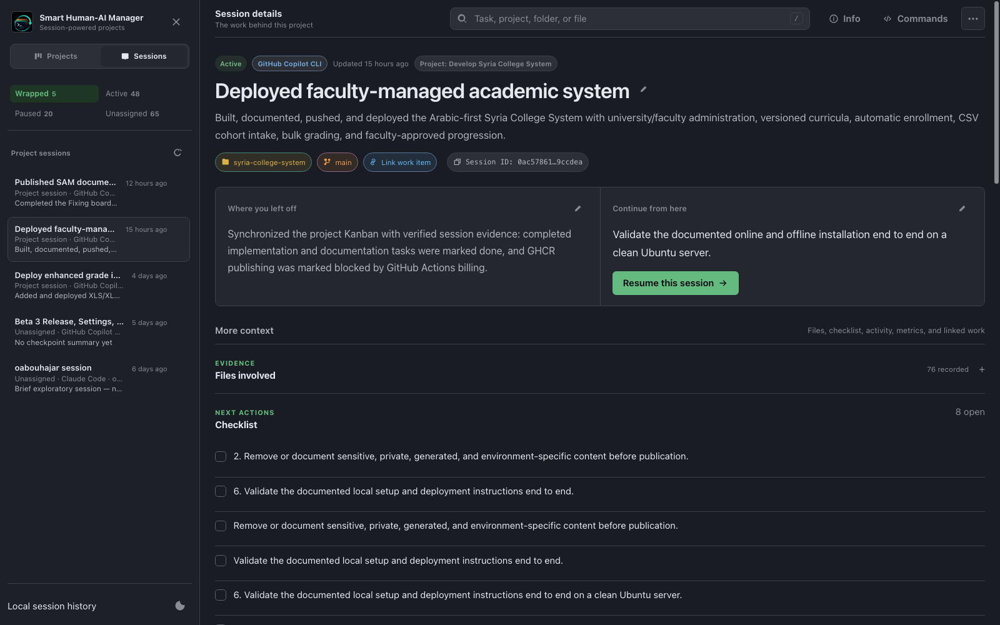
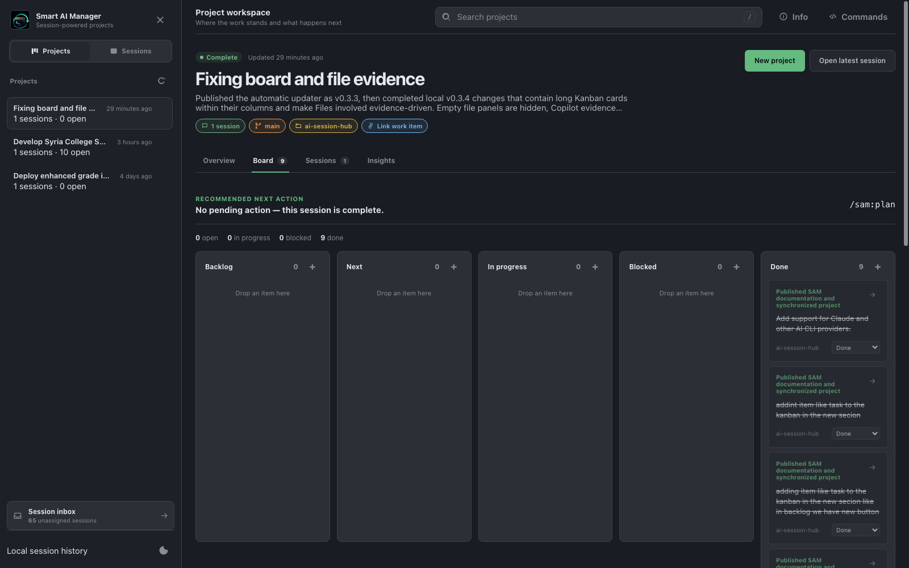

<p align="center">
  
</p>

<p align="center"><strong>Local-first AI project management built from your coding sessions.</strong></p>

Turn AI conversations into explicit projects with tasks, decisions, progress, effort, and a clear next action.

<p align="center">
  <a href="https://oabouhajar.github.io/ai-session-hub/"><strong>Visit the website</strong></a>
  ·
  <a href="#quick-start">Install AI Session Hub</a>
</p>

> Supports **GitHub Copilot CLI**, **Claude Code**, **OpenAI Codex CLI**, and **Google Gemini CLI**.
>
> Independent open source software; not an official GitHub, Microsoft, Anthropic, OpenAI, or Google product.



## Start here

| I want to… | Go to |
|---|---|
| Install AI Session Hub | [Quick start](#quick-start) |
| Set up a specific AI CLI | [Provider guides](docs/providers/README.md) |
| Manage sessions as goal-based projects | [Project workspace](#project-workspace) |
| Understand wrapping and resume | [Daily workflow](#daily-workflow) |
| Check storage and privacy | [Data and privacy](#data-and-privacy) |
| Upgrade or uninstall | [Maintenance](#maintenance) |
| Develop or contribute | [Development](#development) |

## At a glance

| Question | Answer |
|---|---|
| What does it do? | Turns AI CLI sessions into measurable, goal-based project work |
| Where does it run? | Locally at `http://127.0.0.1:43120` |
| Where is data stored? | In a local SQLite database |
| Does it upload sessions? | No |
| Which systems are supported? | macOS and Windows |
| Which providers are supported? | Copilot, Claude, Codex, and Gemini |
| Can it resume sessions? | Yes, using the matching provider command |

## What you get

- Automatic lifecycle tracking for supported AI CLIs.
- Explicit projects that can combine related sessions without grouping unrelated work from the same repository.
- Project overview, Kanban board, session history, progress, time, effort, and AI usage.
- Search across tasks, summaries, actions, projects, folders, and files.
- Clear current state, completed work, blockers, and recommended next action.
- Structured wrap checkpoints and next-session todo lists.
- Provider-specific resume commands.
- In-app **Info** panel with the installed version, provider configuration, update status, release notes, and GitHub links.
- Local-only storage with safe upgrades.

## Quick start

### Ask an AI CLI to install it (recommended)

Copy this prompt into Copilot, Claude, Codex, or Gemini:

<details open>
<summary><strong>Show installation prompt</strong></summary>

```text
Install AI Session Hub from https://github.com/OAbouHajar/ai-session-hub on this machine.

Detect the operating system first. On macOS, verify git, Node.js 22.13+, and at least one supported AI CLI, then run `./scripts/install.sh --no-open`. On Windows, also verify PowerShell 7 and run `pwsh -File .\scripts\install.ps1 -NoOpen`. Stop on unsupported systems.

Clone the latest main branch into a temporary directory, read the README and matching installer, preserve existing Session Hub data and unrelated AI CLI settings, and configure every detected provider. Verify `http://127.0.0.1:43120/api/health` returns `ok: true`, open the dashboard, and report the installed version, configured providers, and any remaining restart or trust action. Proceed autonomously and only ask before administrator-required or destructive actions.
```

Full prompts: [macOS](docs/copilot-install-prompt-macos.md) · [Windows](docs/copilot-install-prompt.md)

</details>

### Install manually

Requirements: Git, Node.js 22.13+, a signed-in supported AI CLI, and PowerShell 7 on Windows.

**macOS**

```bash
git clone https://github.com/OAbouHajar/ai-session-hub.git
cd ai-session-hub
./scripts/install.sh
```

**Windows**

```powershell
git clone https://github.com/OAbouHajar/ai-session-hub.git
cd ai-session-hub
pwsh -File .\scripts\install.ps1
```

The installer detects available providers, preserves existing settings and session data, configures the required hooks, starts the local service, and opens the dashboard.

## Provider support

| Provider | Tracking | Resume | Wrap interaction | Guides |
|---|---|---|---|---|
| GitHub Copilot CLI | Yes | `copilot --resume=<id>` | `/sesh-wrap` or natural language | [Setup](docs/providers/github-copilot/setup.md) · [Usage](docs/providers/github-copilot/usage.md) |
| Claude Code | Yes | `claude --resume <id>` | “Wrap this session” | [Setup](docs/providers/claude-code/setup.md) · [Usage](docs/providers/claude-code/usage.md) |
| OpenAI Codex CLI | Yes | `codex resume <id>` | “Wrap this session” | [Setup](docs/providers/codex/setup.md) · [Usage](docs/providers/codex/usage.md) |
| Google Gemini CLI | Yes | `gemini --resume <id>` | “Wrap this session” | [Setup](docs/providers/gemini/setup.md) · [Usage](docs/providers/gemini/usage.md) |

AI Session Hub uses documented lifecycle hooks rather than unstable provider transcript formats. Historical import is currently available only for supported Copilot CLI history.

## Daily workflow

1. Start or resume a supported AI CLI session.
2. Run `/sesh-project` when the session belongs to a larger goal; create a project or explicitly link it to one.
3. Work normally while AI Session Hub tracks lifecycle events.
4. Before leaving, ask the assistant to **wrap this session** or **checkpoint this session**.
5. Review project progress, tasks, effort, blockers, and the recommended next action in the dashboard.
6. Resume the right session when you are ready to continue.

Sessions remain **Unassigned** until you choose a project. Repository and folder matches may be suggested, but AI Session Hub never merges sessions automatically.

Copilot also includes:

| Command | Purpose |
|---|---|
| `/sesh-wrap` | Save a continuity checkpoint |
| `/sesh-handoff` or `/sesh-next` | Save a checkpoint with an explicit todo list |
| `/sesh-reopen` | Remove a session from Wrapped while preserving its saved data |
| `/sesh-project` | Create, link, switch, inspect, unlink, or complete an explicit project |
| `/sesh-plan` | Build an ordered plan from unfinished work |
| `/sesh-sync` | Reconcile project state with actual progress |
| `/sesh-do` | Execute the next actionable project task |
| `/sesh-update` | Download, verify, and install the latest stable release automatically |

The previous `/wrap`, `/wrap-with-next`, `/unwrap`, `/hub-project`, `/hub-update`, and `/kanban*` commands remain available as compatibility aliases.

## Project workspace

Create projects around goals—not repositories. One repository can have separate projects for a release, a feature, an investigation, or any other workstream. Each session belongs to at most one primary project and can be moved or returned to Unassigned at any time.

The project workspace combines:

- A concise overview of current state, next action, blockers, and progress.
- A Kanban board with **Backlog**, **Next**, **In progress**, **Blocked**, and **Done**.
- Every explicitly linked session and its file evidence.
- Time, AI credits, effort, and completion insights.
- Project-level Azure DevOps work-item links.



## How it works

```text
Supported AI CLI hooks
          |
          v
Local Node.js service on 127.0.0.1
          |
          v
Local SQLite continuity store
          |
          v
Searchable browser dashboard
```

Hooks record lifecycle events and provide the assistant with the local checkpoint endpoint. A wrap request writes the useful semantic handoff while conversation context is still available.

## Data and privacy

| Item | macOS | Windows |
|---|---|---|
| Session data | `~/Library/Application Support/CopilotSessionHub` | `%LOCALAPPDATA%\CopilotSessionHub` |
| Application | `~/Library/Application Support/AI Session Hub/app` | `%LOCALAPPDATA%\Programs\CopilotSessionHub` |

- The service binds only to `127.0.0.1`.
- Session data remains local.
- Reinstall, upgrade, and uninstall preserve the SQLite database.
- Existing legacy macOS data in `~/.copilot-session-hub` remains supported.
- Request origin checks and anti-framing headers protect local actions.

## Maintenance

### Upgrade

When a stable release is available, Session Hub shows a dashboard banner and adds one short notice after a wrap. Update checks use the GitHub Releases API at most once every 24 hours and do not include session data.

Copilot users can run `/sesh-update` for a one-command upgrade. Session Hub downloads and verifies the exact stable release in the background. Exit active AI CLI sessions when prompted; installation, dashboard restart, health verification, and cleanup then finish automatically. The next session reports whether the update succeeded.

To check manually, or when upgrading an older installation that predates update notifications, pull the latest source and rerun the installer:

```bash
git pull
./scripts/install.sh --no-open
```

```powershell
git pull
pwsh -File .\scripts\install.ps1 -NoOpen
```

Set `COPILOT_SESSION_HUB_UPDATE_CHECK=0` when running the installer to disable automatic release checks. The choice is preserved by the installed background service.

### Uninstall

```bash
./scripts/uninstall.sh
```

```powershell
pwsh -File .\scripts\uninstall.ps1
```

Uninstalling removes integrations but leaves session data intact.

## Development

```bash
npm start
npm test
```

The project has no runtime npm dependencies. It uses Node.js built-ins including `node:http`, `node:sqlite`, and the native test runner.

Stable updates are published through semantic tags such as `v0.3.0`. Before pushing a release tag, set the same version in `package.json` and `plugin.json`. The release workflow verifies both versions, runs the test suite, and creates the GitHub Release used by installed update checkers.

## License

[MIT](LICENSE)
