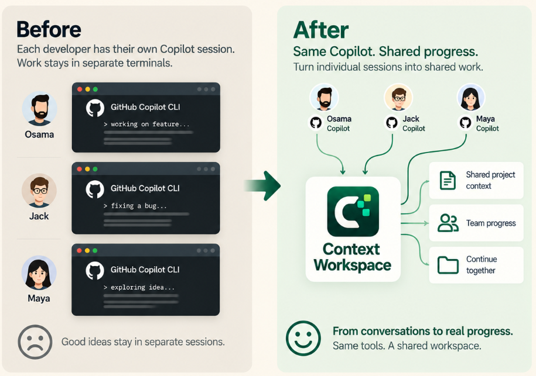

<p align="center">
  
</p>

<h1 align="center">Context Workspace</h1>

<p align="center"><strong>Where AI work becomes shared projects.</strong></p>

<p align="center">
  Turn separate AI sessions into one visual project that people and agents can share, manage, search, and measure.
</p>

<p align="center">
  
  
  &nbsp;&nbsp;
  
  &nbsp;&nbsp;
  
  
  &nbsp;&nbsp;
  
  &nbsp;&nbsp;
  
</p>

<p align="center">
  <a href="https://oabouhajar.github.io/smart-ai-human-manager/"><strong>Website and demo</strong></a>
  ·
  <a href="https://oabouhajar.github.io/smart-ai-human-manager/dashboard-demo.html">Interactive dashboard</a>
  ·
  <a href="#install">Install</a>
  ·
  <a href="docs/providers/README.md">Provider guides</a>
</p>

<p align="center">
  
</p>

## Why Context Workspace?

AI conversations create real work, but their context is usually scattered across terminals, sessions, tools, and Markdown files.

Context Workspace converts that activity into a local visual project:

- **Share:** hand verified project progress to another person or agent without publishing private conversations.
- **Manage:** organize tasks across Backlog, Next, In progress, Blocked, and Done.
- **Measure:** understand progress, time, models, tokens, credits, files, and contribution.
- **Continue:** preserve decisions, blockers, evidence, and one clear next action.

Session conversations and local file contents stay private. Shared project snapshots contain sanitized work state, not prompts or transcripts.

## What you get

- Searchable AI session history and project context.
- Visual Kanban boards built from AI-assisted work.
- Human owner, AI agent, model recommendation, reasoning effort, and status per ticket.
- Checkpoints, handoffs, auto-wrap, project planning, review, and retrospectives.
- Safe Git-based project sharing across people, machines, and agents.
- A local dashboard at `http://127.0.0.1:43120`.
- Local SQLite storage with no hosted Context Workspace service.

## Supported agents

| Agent | Tracking | Continue work |
|---|---|---|
| GitHub Copilot CLI | Automatic lifecycle hooks | `copilot --resume=<id>` |
| Claude Code | Automatic lifecycle hooks | `claude --resume <id>` |
| OpenAI Codex CLI | Automatic lifecycle hooks | `codex resume <id>` |
| Google Gemini CLI | Automatic lifecycle hooks | `gemini --resume <id>` |
| Microsoft Scout | Managed skill, including `/cw:` chat commands | Restore from Scout history |

Scout accepts `/cw:wrap`, `/cw:wrap-session`, `/cw:handoff`, `/cw:project`, and natural-language Context Workspace requests.

## Install

Requirements:

- macOS or Windows
- Git
- Node.js 22.13 or newer
- PowerShell 7 on Windows
- At least one supported AI agent

### Install with an AI agent

Copy this prompt into Copilot, Scout, Claude, Codex, Gemini, or another capable agent:

```text
Install Context Workspace from https://github.com/OAbouHajar/smart-ai-human-manager on this machine.

Detect the operating system first. On macOS, verify git, Node.js 22.13+, and at least one supported AI agent, then run `./scripts/install.sh --no-open`. On Windows, also verify PowerShell 7 and run `pwsh -File .\scripts\install.ps1 -NoOpen`. Stop on unsupported systems.

Clone the latest main branch into a temporary directory, read the README and matching installer, preserve existing Context Workspace data and unrelated AI settings, and configure every detected provider. Verify `http://127.0.0.1:43120/api/health` returns `ok: true`, open the dashboard, and report the installed version, configured providers, and any remaining restart action. Proceed autonomously and only ask before administrator-required or destructive actions.
```

### Install manually

**macOS**

```bash
git clone https://github.com/OAbouHajar/smart-ai-human-manager.git
cd smart-ai-human-manager
./scripts/install.sh
```

**Windows**

```powershell
git clone https://github.com/OAbouHajar/smart-ai-human-manager.git
Set-Location .\smart-ai-human-manager
pwsh -File .\scripts\install.ps1
```

The installer preserves existing data and unrelated agent settings, configures detected providers, starts the local service, and opens the dashboard.

## Basic workflow

1. Work normally with a supported AI agent.
2. Link the session to a project when the work belongs to a larger goal.
3. Wrap or hand off the session to preserve completed work and next actions.
4. Manage the resulting work on the visual board.
5. Resume locally or share a sanitized project snapshot with a teammate.

Common Copilot commands include:

```text
/cw:project
/cw:wrap
/cw:handoff
/cw:plan
/cw:work
/cw:sync
/cw:review
/cw:retro
/cw:update
```

See the [daily workflow and complete command reference](docs/providers/github-copilot/usage.md).

## Privacy

| Item | macOS | Windows |
|---|---|---|
| Session data | `~/Library/Application Support/ContextWorkspace` | `%LOCALAPPDATA%\ContextWorkspace` |
| Application | `~/Library/Application Support/Context Workspace/app` | `%LOCALAPPDATA%\Programs\ContextWorkspace` |

- The service binds only to `127.0.0.1`.
- Session data remains local.
- Reinstall, update, and uninstall preserve the SQLite database.
- Shared boards exclude prompts, transcripts, source code, credentials, raw logs, and local paths.

## Development

```bash
npm start
npm test
```

## Update or uninstall

Copilot users can run:

```text
/cw:update
```

Manual update:

```bash
./scripts/install.sh --no-open
```

```powershell
pwsh -File .\scripts\install.ps1 -NoOpen
```

Uninstall:

```bash
./scripts/uninstall.sh
```

```powershell
pwsh -File .\scripts\uninstall.ps1
```

Uninstalling removes integrations and application files while preserving session data.

---

Context Workspace is independent open source software and is not an official GitHub, Microsoft, Anthropic, OpenAI, or Google product.
