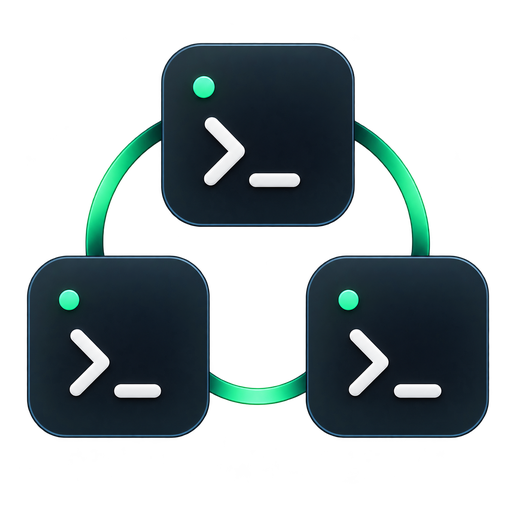

<p align="center">
  
</p>

<h1 align="center">Context Workspace</h1>

<p align="center"><strong>Where AI sessions become shared work.</strong></p>

Turn private AI coding sessions into shared project context with tasks, decisions, progress, evidence, and a clear next action.

<p align="center">
  <a href="https://oabouhajar.github.io/smart-ai-human-manager/"><strong>Visit the website</strong></a>
  ·
  <a href="#quick-start">Install Context Workspace</a>
</p>

> Supports **GitHub Copilot CLI**, **Claude Code**, **OpenAI Codex CLI**, and **Google Gemini CLI**.
>
> Independent open source software; not an official GitHub, Microsoft, Anthropic, OpenAI, or Google product.


## Start here

| I want to… | Go to |
|---|---|
| Install Context Workspace | [Quick start](#quick-start) |
| Set up a specific AI CLI | [Provider guides](docs/providers/README.md) |
| Manage sessions as goal-based projects | [Project workspace](#project-workspace) |
| Understand wrapping and resume | [Daily workflow](#daily-workflow) |
| Check storage and privacy | [Data and privacy](#data-and-privacy) |
| Upgrade or uninstall | [Maintenance](#maintenance) |
| Develop or contribute | [Development](#development) |

## At a glance

| Question | Answer |
|---|---|
| What does it do? | Turns AI CLI sessions into measurable, goal-based project work |
| Where does it run? | Locally at `http://127.0.0.1:43120` |
| Where is data stored? | In a local SQLite database |
| Does it upload sessions? | No |
| Which systems are supported? | macOS and Windows |
| Which providers are supported? | Copilot, Claude, Codex, and Gemini |
| Can it resume sessions? | Yes, using the matching provider command |

## What you get

- Automatic lifecycle tracking for supported AI CLIs.
- Explicit projects that can combine related sessions without grouping unrelated work from the same repository.
- Project overview, Kanban board, session history, progress, questions and actions, decisions, blockers, contributors, agent mix, wrap coverage, time, cumulative AI tokens, credits, and effort.
- Search across tasks, summaries, actions, projects, folders, and files.
- Clear current state, completed work, blockers, and recommended next action.
- Structured wrap checkpoints and next-session todo lists.
- Optional evidence-preserving auto-wraps before context compaction and on session exit.
- Provider-specific resume commands.
- In-app **Info** panel with the installed version, provider configuration, update status, release notes, and GitHub links.
- Local-only storage with safe upgrades.

## Quick start

### Ask an AI CLI to install it (recommended)

Copy this prompt into Copilot, Claude, Codex, or Gemini:

<details open>
<summary><strong>Show installation prompt</strong></summary>

```text
Install Context Workspace from https://github.com/OAbouHajar/smart-ai-human-manager on this machine.

Detect the operating system first. On macOS, verify git, Node.js 22.13+, and at least one supported AI CLI, then run `./scripts/install.sh --no-open`. On Windows, also verify PowerShell 7 and run `pwsh -File .\scripts\install.ps1 -NoOpen`. Stop on unsupported systems.

Clone the latest main branch into a temporary directory, read the README and matching installer, preserve existing Context Workspace and legacy SHAM data plus unrelated AI CLI settings, and configure every detected provider. Verify `http://127.0.0.1:43120/api/health` returns `ok: true`, open the dashboard, and report the installed version, configured providers, and any remaining restart or trust action. Proceed autonomously and only ask before administrator-required or destructive actions.
```

Full prompts: [macOS](docs/copilot-install-prompt-macos.md) · [Windows](docs/copilot-install-prompt.md)

</details>

### Install manually

Requirements: Git, Node.js 22.13+, a signed-in supported AI CLI, and PowerShell 7 on Windows.

**macOS**

```bash
git clone https://github.com/OAbouHajar/smart-ai-human-manager.git
cd smart-ai-human-manager
./scripts/install.sh
```

**Windows**

```powershell
git clone https://github.com/OAbouHajar/smart-ai-human-manager.git
cd smart-ai-human-manager
pwsh -File .\scripts\install.ps1
```

The installer detects available providers, preserves existing settings and session data, configures the required hooks, starts the local service, and opens the dashboard.

## Provider support

| Provider | Tracking | Resume | Wrap interaction | Guides |
|---|---|---|---|---|
| GitHub Copilot CLI | Yes | `copilot --resume=<id>` | `/cw:wrap` or natural language | [Setup](docs/providers/github-copilot/setup.md) · [Usage](docs/providers/github-copilot/usage.md) |
| Claude Code | Yes | `claude --resume <id>` | “Wrap this session” | [Setup](docs/providers/claude-code/setup.md) · [Usage](docs/providers/claude-code/usage.md) |
| OpenAI Codex CLI | Yes | `codex resume <id>` | “Wrap this session” | [Setup](docs/providers/codex/setup.md) · [Usage](docs/providers/codex/usage.md) |
| Google Gemini CLI | Yes | `gemini --resume <id>` | “Wrap this session” | [Setup](docs/providers/gemini/setup.md) · [Usage](docs/providers/gemini/usage.md) |

Context Workspace uses documented lifecycle hooks rather than unstable provider transcript formats. Historical import is currently available only for supported Copilot CLI history.

## Daily workflow

1. Start or resume a supported AI CLI session.
2. Run `/cw:project` when the session belongs to a larger goal; create a project or explicitly link it to one.
3. Work normally while Context Workspace tracks lifecycle events.
4. When linking a session to a project, choose whether that session should auto-wrap. Unassigned sessions stay manual unless you enable them individually. Use **wrap this session** or `/cw:wrap` whenever you want a richer, intentional handoff.
5. Review project progress, tasks, effort, blockers, and the recommended next action in the dashboard.
6. Resume the right session when you are ready to continue.

Sessions remain **Unassigned** until you choose a project. Repository and folder matches may be suggested, but Context Workspace never merges sessions automatically.

Every project has a stable UUID shown in the project header. Click it to copy the ID, then link a new session directly with:

```text
/cw:project <project-id>
```

Direct ID linking keeps auto-wrap off unless you explicitly request it.

### Share project work through Git

Project sharing publishes the work, not the AI conversation. `/cw:project-share` writes a sanitized board snapshot to the dedicated `context-workspace/shared-projects` branch on the repository's configured Git remote. Teammates use `/cw:project-pull` to import that board into their local dashboard and connect a new local AI session to the same project.

Shared snapshots contain project details, tickets, status, human owner, AI agent, completion attribution, revisions, and a sanitized continuation context with the latest summary, completed work, blockers, next action, and a generated teammate starter prompt. They exclude original prompts, transcripts, raw responses, source code, local paths, credentials, and tool logs. The sharing branch is independent and must not be merged into the product's code branches.

Pushes use normal non-force Git updates. Concurrent changes are rejected rather than overwritten; pull and reconcile the local board before publishing again.

Copilot includes **Context Workspace** commands:

| Command | Purpose |
|---|---|
| `/cw:wrap` | Save the session checkpoint and update its linked project |
| `/cw:handoff` | Wrap with an explicit next-session todo list |
| `/cw:reopen` | Return a wrapped session to active review |
| `/cw:project` | Create, link, switch, inspect, unlink, or complete a project |
| `/cw:project-share` | Preview and publish a sanitized project board to a dedicated Git branch |
| `/cw:project-push` | Push local shared-board updates without publishing conversations or code |
| `/cw:project-pull` | Import a teammate's shared board and link the current local session |
| `/cw:archive` | Archive or restore a project without deleting its history |
| `/cw:auto-wrap on\|off\|status\|default` | Control automatic wrapping for the current session |
| `/cw:refine` | Clarify, split, and prioritize backlog work |
| `/cw:plan` | Build an ordered plan from unfinished work |
| `/cw:work` | Execute the best ready project task |
| `/cw:sync` | Reconcile project state with actual evidence |
| `/cw:review` | Validate delivered work against its intended outcome |
| `/cw:retro` | Turn project experience into concrete improvements |
| `/cw:update` | Download, verify, and install the latest stable release automatically |

Context Workspace combines session continuity with an AI-assisted agile cycle:

```text
refine → plan → work → sync → review → retro
```

The human owns goals, priorities, acceptance, and process decisions. Context Workspace prepares the evidence, keeps the board current, executes approved work, and proposes changes for confirmation.

Existing `/sham:*` commands remain available as compatibility aliases for `/cw:*` during the transition period.

## Project workspace

Create projects around goals—not repositories. One repository can have separate projects for a release, a feature, an investigation, or any other workstream. Each session belongs to at most one primary project and can be moved or returned to Unassigned at any time.

Archive finished or paused projects to remove them from active views while preserving every linked session, task, decision, metric, and file record. Archived projects remain available in the dashboard and can be restored at any time.

The project workspace combines:

- A concise overview of current state, next action, blockers, and progress.
- A Kanban board with **Backlog**, **Next**, **In progress**, **Blocked**, and **Done**.
- Every explicitly linked session and its file evidence.
- A session picker in the **Sessions** tab for linking an existing unassigned session with an explicit auto-wrap choice.
- Time, AI credits, effort, and completion insights.
- Project-level Azure DevOps work-item links.


## How it works

```text
Supported AI CLI hooks
          |
          v
Local Node.js service on 127.0.0.1
          |
          v
Local SQLite continuity store
          |
          v
Searchable browser dashboard
```

Hooks record lifecycle events and provide the assistant with the local checkpoint endpoint. Auto-wrap can be enabled for an individual session when you link it to a project or from its session menu. The global preference is only a default for deliberately linked project sessions; it never auto-wraps every unassigned session. When Copilot exposes a generated checkpoint, Context Workspace synchronizes its summary into the automatic wrap. Manual wraps remain authoritative. Context Workspace never creates or assigns projects automatically.

## Data and privacy

| Item | macOS | Windows |
|---|---|---|
| Session data | `~/Library/Application Support/ContextWorkspace` | `%LOCALAPPDATA%\ContextWorkspace` |
| Application | `~/Library/Application Support/Context Workspace/app` | `%LOCALAPPDATA%\Programs\ContextWorkspace` |

- The service binds only to `127.0.0.1`.
- Session data remains local.
- Reinstall, upgrade, and uninstall preserve the SQLite database.
- Existing SHAM and Copilot Session Hub data directories remain supported and are never deleted automatically.
- Request origin checks and anti-framing headers protect local actions.

## Maintenance

### Upgrade

When a stable release is available, Context Workspace shows a dashboard banner and adds one short notice after a wrap. Update checks use the GitHub Releases API at most once every 24 hours and do not include session data.

Copilot users can run `/cw:update` for a one-command upgrade. Context Workspace downloads and verifies the exact stable release in the background. Exit active AI CLI sessions when prompted; installation, dashboard restart, health verification, and cleanup then finish automatically. The next session reports whether the update succeeded.

To check manually, or when upgrading an older installation that predates update notifications, pull the latest source and rerun the installer:

```bash
git pull
./scripts/install.sh --no-open
```

```powershell
git pull
pwsh -File .\scripts\install.ps1 -NoOpen
```

Set `CONTEXT_WORKSPACE_UPDATE_CHECK=0` when running the installer to disable automatic release checks. `COPILOT_SESSION_HUB_UPDATE_CHECK` remains supported as a legacy fallback.

### Uninstall

```bash
./scripts/uninstall.sh
```

```powershell
pwsh -File .\scripts\uninstall.ps1
```

Uninstalling removes integrations but leaves session data intact.

## Development

```bash
npm start
npm test
```

The project has no runtime npm dependencies. It uses Node.js built-ins including `node:http`, `node:sqlite`, and the native test runner.

Stable updates are published through semantic tags such as `v0.3.0`. Before pushing a release tag, set the same version in `package.json` and `plugin.json`. The release workflow verifies both versions, runs the test suite, and creates the GitHub Release used by installed update checkers.

## License

[MIT](LICENSE)
